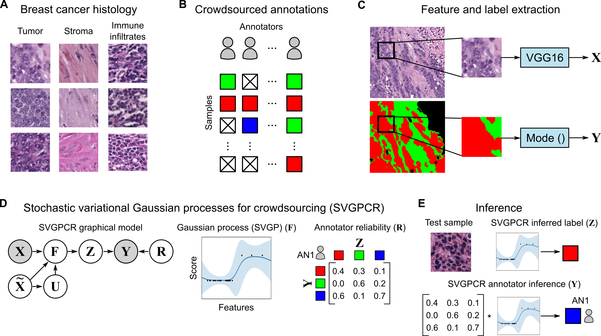
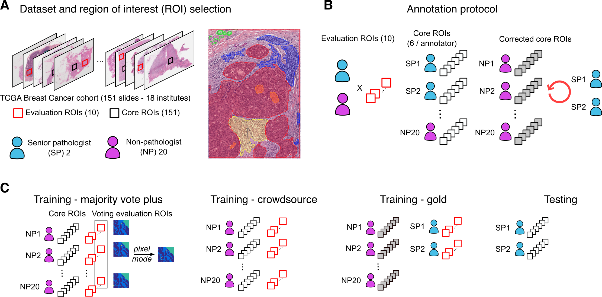
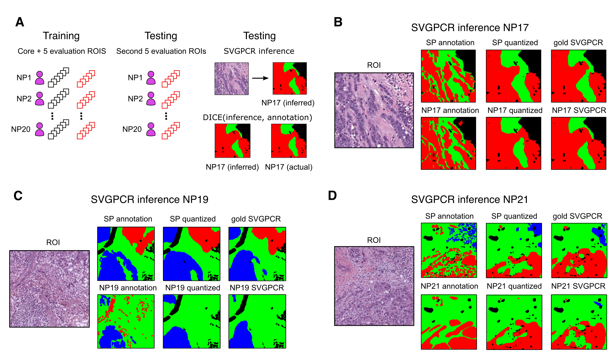

# Learning from crowds in digital pathology using scalable variational Gaussian processes

### Code for replicating the results of the paper [Learning from crowds in digital pathology using scalable variational Gaussian processes](https:)

#### Citation
~~~
@ARTICLE{}
~~~

## Abstract
The volume of labeled data is often the primary determinant of success in developing machine learning algorithms. This has increased interest in methods for leveraging crowds to scale data labeling efforts, and methods to learn from noisy crowd-sourced labels. The need to scale labeling is acute but particularly challenging in medical applications like pathology, due to the expertise required to generate quality labels and the limited availability of qualified experts. In this paper we investigate the application of Scalable Variational Gaussian Processes for Crowdsourcing (SVGPCR) in digital pathology. We compare SVGPCR with other crowdsourcing methods using a large multi-rater dataset where pathologists, pathology residents, and medical students annotated tissue regions breast cancer. Our study shows that SVGPCR is competitive with equivalent methods trained using gold-standard pathologist generated labels, and that SVGPCR meets or exceeds the performance of other crowdsourcing methods based on deep learning. We also show how SVGPCR can effectively learn the class-conditional reliabilities of individual annotators and demonstrate that gaussian-process classifiers have comparable performance to similar deep learning methods. These results suggest that SVGPCR can meaningfully engage non-experts in pathology labeling tasks, and that the class-conditional reliabilities estimated by SVGPCR may assist in matching annotators to tasks where they perform well.

 ## Description of the repo
 This repo contains the code used for the paper "Learning from crowds in digital pathology using scalable variational Gaussian processes". We include all the scripts for preprocessing the database as well as for the crowdsource classification.

 A detailed explanation of the tree directory is detailed below.

- [Code](code/) Contains the code used in the work.
  - [svgpcr_method](code/svgpcr_method) Contains the code used for feature extraction and classification using VGG16 and Gaussian Processes.
     - [svgpcr.py](code/svgpcr_method/svgpcr.py) The code for the crowdsourcing classification method based on gaussian processes.
  - [preprocessing_database](code/preprocessing_database) contains the code for preprocessing the database: color normalization, extracting patches, annotations, etc.
  - [other_CR_methods](code/other_CR_methods) Contains the code for using other crowdsourcing classification methods based on DL.

## Data source

The data used was published in "Structured crowdsourcing enables convolutional segmentation of histology images", Amgad et. al (2019). This data is freely and publicly available. See the full citation below:
~~~
@article{amgad:2019,
    author = {Amgad, Mohamed and Elfandy, Habiba and Hussein, Hagar and Atteya, Lamees A and Elsebaie, Mai A T and Abo Elnasr, Lamia S and Sakr, Rokia A and Salem, Hazem S E and Ismail, Ahmed F and Saad, Anas M and Ahmed, Joumana and Elsebaie, Maha A T and Rahman, Mustafijur and Ruhban, Inas A and Elgazar, Nada M and Alagha, Yahya and Osman, Mohamed H and Alhusseiny, Ahmed M and Khalaf, Mariam M and Younes, Abo-Alela F and Abdulkarim, Ali and Younes, Duaa M and Gadallah, Ahmed M and Elkashash, Ahmad M and Fala, Salma Y and Zaki, Basma M and Beezley, Jonathan and Chittajallu, Deepak R and Manthey, David and Gutman, David A and Cooper, Lee A D},
    title = "{Structured crowdsourcing enables convolutional segmentation of histology images}",
    journal = {Bioinformatics},
    volume = {35},
    number = {18},
    pages = {3461-3467},
    year = {2019},
    month = {02},
    issn = {1367-4803},
    doi = {10.1093/bioinformatics/btz083},
    url = {https://doi.org/10.1093/bioinformatics/btz083},
    eprint = {https://academic.oup.com/bioinformatics/article-pdf/35/18/3461/30024472/btz083.pdf},
}
~~~

## Figures

### Approach

### Training setting

### Predictions

## DEMO
### Install dependencies
~~~
$ conda install gpflow
~~~

### Run the code
- Download the data which is publicly available at https://github.com/CancerDataScience/CrowdsourcingDataset-Amgadetal2019.
-
